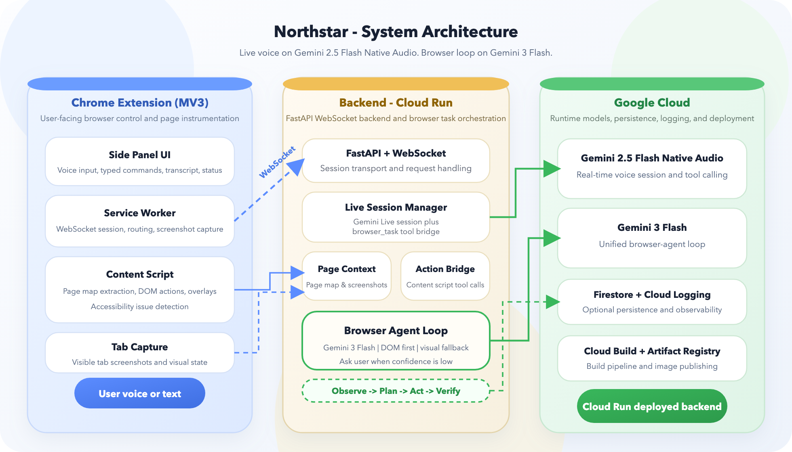

# Northstar

Accessibility autopilot for the broken web.

Northstar is a Chrome extension plus a FastAPI backend that helps blind and low-vision users operate inaccessible websites in real time. It uses semantic page understanding first, multimodal visual grounding when markup breaks down, and verification after every action so it can move through hostile UI more safely than blind browser automation.

Built for the Gemini Live Agent Challenge.



## What Northstar does

- Describes the current page and calls out accessibility barriers
- Executes voice-first browser tasks from a persistent Chrome side panel
- Uses semantic controls first, then screenshot-guided fallback when the DOM is insufficient
- Verifies whether an action actually changed the page in the expected way
- Explains why a flow is difficult for screen reader and keyboard users

## How it works

1. The Chrome extension collects page state, user commands, and screenshots from the active tab.
2. The backend orchestrates live conversation, planning, browser actions, and verification over WebSockets.
3. Gemini Live handles the real-time interaction loop.
4. Gemini multimodal reasoning is used when accessibility metadata and page structure are not enough.
5. Session state can persist to Firestore when configured, or fall back to in-memory/local recording during local development.

## Repository layout

```text
backend/       FastAPI WebSocket backend, planning, verification, session logic
demo-site/     Intentionally broken demo site used in the live walkthrough
docs/          Architecture diagram and demo script
extension/     Chrome extension, side panel, service worker, content script
infra/         Cloud Build configuration for container build + Cloud Run deploy
```

## Spin-up Instructions

These are the project setup steps judges need to reproduce the local demo.

### Prerequisites

- Python 3.12
- Google Chrome
- A Gemini API key
- Optional: Google Cloud CLI and a GCP project if you want Firestore, Cloud Logging, or Cloud Run deployment

### 1. Start the backend

```bash
cd backend
python3 -m venv .venv
source .venv/bin/activate
pip install -r requirements.txt
cp .env.example .env
```

Set the environment variables in `backend/.env`:

```env
GEMINI_API_KEY=your-gemini-api-key
GCP_PROJECT=your-gcp-project-id
```

Notes:

- `GEMINI_API_KEY` is required.
- `GCP_PROJECT` is optional for local use. If Firestore or Cloud Logging are unavailable, the backend falls back gracefully for local development.

Run the backend:

```bash
uvicorn app.main:app --host 0.0.0.0 --port 8080
```

Useful local endpoint:

- `http://localhost:8080/health`

### 2. Start the demo site

From the repository root:

```bash
python3 -m http.server 8765 --directory demo-site
```

Then open:

```text
http://localhost:8765
```

### 3. Load the extension

1. Open `chrome://extensions`.
2. Enable `Developer mode`.
3. Click `Load unpacked`.
4. Select the `extension/` directory from this repository.
5. Pin the Northstar extension.

### 4. Run the local demo

1. Open `http://localhost:8765`.
2. Click the Northstar extension icon to open the side panel.
3. Grant microphone permission if prompted.
4. Ask Northstar to describe the page, or type a command in the panel.
5. Try a task such as filtering products, adding an item to the cart, or completing checkout.

The extension's default backend target is local development:

```text
ws://localhost:8080/ws
```

## Reproducible Testing

Judges can verify Northstar in two ways: a fast automated backend test pass and a short end-to-end browser demo.

### 1. Automated backend tests

After completing the backend setup above:

```bash
cd backend
source .venv/bin/activate
pytest tests -q
```

Expected result: all backend tests pass. At submission time this returned `33 passed`.

### 2. End-to-end local smoke test

With the backend running on `http://localhost:8080`, the demo site running on `http://localhost:8765`, and the extension loaded:

1. Open `http://localhost:8765`.
2. Open the Northstar side panel from the Chrome toolbar.
3. If microphone permission is inconvenient in the judge environment, use the keyboard toggle and type the same commands instead of speaking them.
4. Run these commands in order:

- `Describe this page`
- `Filter to show only items under 50 dollars and sort by rating`
- `Add the top-rated item to cart`
- `Go to checkout`
- `Why was that hard for a screen reader?`

Expected results:

- Northstar describes the TechMart demo page and calls out accessibility barriers.
- Northstar applies the price filter and sort change on the broken UI.
- Northstar adds an item to the cart and opens checkout.
- Northstar explains why the flow is difficult on this page and surfaces the barriers it found.

### 3. Basic backend health check

If you only want to verify that the backend is up before running the full demo:

```bash
curl http://localhost:8080/health
```

Expected result: a JSON response with `"status": "ok"`.

## Cloud deployment

The repository includes a Cloud Build pipeline at `infra/cloudbuild.yaml` that builds the backend image, pushes it to Artifact Registry, and deploys it to Cloud Run.

Example deployment command:

```bash
gcloud builds submit --config infra/cloudbuild.yaml .
```

If you want the extension to use a deployed backend instead of localhost, update the `BACKEND_URL` constant in `extension/service-worker.js` from:

```text
ws://localhost:8080/ws
```

to your Cloud Run WebSocket endpoint:

```text
wss://<your-cloud-run-service>/ws
```

## Challenge artifacts

- Devpost submission copy: `DEVPOST_SUBMISSION.md`
- Marketing gallery graphic: `docs/devpost-marketing.png`
- Architecture diagram: `docs/architecture.png`
- Demo script: `docs/demo-script.md`
- Cloud deployment config: `infra/cloudbuild.yaml`

## License

Released under the MIT License. See `LICENSE`.
